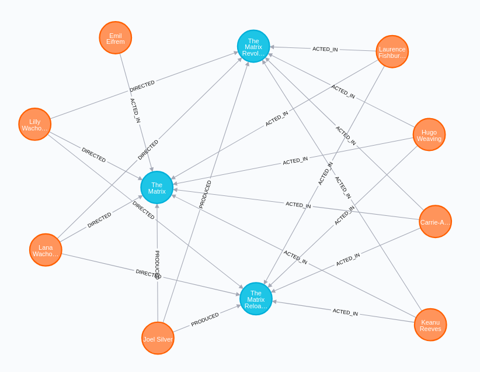
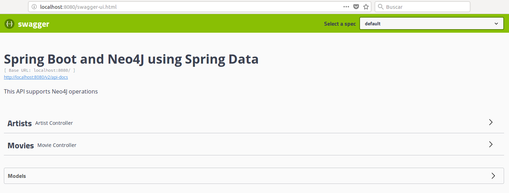

# Spring Boot and Neo4J using Spring Data

Spring Data provides tools that facilitate the use of Neo4J clearly and easily, so the integration of both technologies is very easy to perform.

##### Requeriments

- Neo4J (Run Neo4J with Docker: https://neo4j.com/developer/docker-run-neo4j/)
- JDK 8+


## The problem

It will represent the classic information problem, in which there are many entities and many basic relationships between these entities.

You have information about movies, actors, directors and producers. 

This case requires a good performance when you want to consult information of different types, being the typical case of using a graph database with respect to other types of databases. Thus, an API is required that allows you to consult information about both movies and people.

As an example, a small piece of information will be represented.




## The model

First, the graph model will be created in Neo4J given the previous image.

The elements to be represented in the graph model:

- **Movie**: It is the node that represents a movie.
- **Person**: It is the node that represents a person (actor, director and producer).
- **ACTED_IN**,**DIRECTED**,**PRODUCED**: They are actions that represent relationships between nodes.


To do this, you need to know the Cypher language that Neo4J uses.

```
// build a graph with cypher (nodes and edges)

CREATE (TheMatrix:Movie {title:'The Matrix', released:1999, tagline:'Welcome to the Real World'})
CREATE (Keanu:Person {name:'Keanu Reeves', born:1964})
CREATE (Carrie:Person {name:'Carrie-Anne Moss', born:1967})
CREATE (Laurence:Person {name:'Laurence Fishburne', born:1961})
CREATE (Hugo:Person {name:'Hugo Weaving', born:1960})
CREATE (LillyW:Person {name:'Lilly Wachowski', born:1967})
CREATE (LanaW:Person {name:'Lana Wachowski', born:1965})
CREATE (JoelS:Person {name:'Joel Silver', born:1952})
CREATE
  (Keanu)-[:ACTED_IN {roles:['Neo']}]->(TheMatrix),
  (Carrie)-[:ACTED_IN {roles:['Trinity']}]->(TheMatrix),
  (Laurence)-[:ACTED_IN {roles:['Morpheus']}]->(TheMatrix),
  (Hugo)-[:ACTED_IN {roles:['Agent Smith']}]->(TheMatrix),
  (LillyW)-[:DIRECTED]->(TheMatrix),
  (LanaW)-[:DIRECTED]->(TheMatrix),
  (JoelS)-[:PRODUCED]->(TheMatrix)

CREATE (Emil:Person {name:"Emil Eifrem", born:1978})
CREATE (Emil)-[:ACTED_IN {roles:["Emil"]}]->(TheMatrix)

CREATE (TheMatrixReloaded:Movie {title:'The Matrix Reloaded', released:2003, tagline:'Free your mind'})
CREATE
  (Keanu)-[:ACTED_IN {roles:['Neo']}]->(TheMatrixReloaded),
  (Carrie)-[:ACTED_IN {roles:['Trinity']}]->(TheMatrixReloaded),
  (Laurence)-[:ACTED_IN {roles:['Morpheus']}]->(TheMatrixReloaded),
  (Hugo)-[:ACTED_IN {roles:['Agent Smith']}]->(TheMatrixReloaded),
  (LillyW)-[:DIRECTED]->(TheMatrixReloaded),
  (LanaW)-[:DIRECTED]->(TheMatrixReloaded),
  (JoelS)-[:PRODUCED]->(TheMatrixReloaded)

CREATE (TheMatrixRevolutions:Movie {title:'The Matrix Revolutions', released:2003, tagline:'Everything that has a beginning has an end'})
CREATE
  (Keanu)-[:ACTED_IN {roles:['Neo']}]->(TheMatrixRevolutions),
  (Carrie)-[:ACTED_IN {roles:['Trinity']}]->(TheMatrixRevolutions),
  (Laurence)-[:ACTED_IN {roles:['Morpheus']}]->(TheMatrixRevolutions),
  (Hugo)-[:ACTED_IN {roles:['Agent Smith']}]->(TheMatrixRevolutions),
  (LillyW)-[:DIRECTED]->(TheMatrixRevolutions),
  (LanaW)-[:DIRECTED]->(TheMatrixRevolutions),
  (JoelS)-[:PRODUCED]->(TheMatrixRevolutions)
```

With this, you have the previous model in Neo4J and you could already develop a solution to interact with that graph.


## The solution

On this occasion, use Spring Data with Neo4J is very useful as it provides tools to integrate easily with Neo4J. This will allow perform several operations with Neo4J without knowing the Cypher language (use _CrudRepository_) typical of Neo4J.

##### Spring Data with Neo4J dependency

To use these tools, you just have to add the dependency in the _pom.xml_ file.

```xml
<dependency>
    <groupId>org.springframework.boot</groupId>
	<artifactId>spring-boot-starter-data-neo4j</artifactId>
</dependency>
```

##### Spring Data with Neo4J configuration

To configure the connection, you simply have to define the Neo4J server and its authentication in the application.properties file (or _*.yml_)

```yaml
spring.data.neo4j.uri=bolt://localhost:7687
spring.data.neo4j.username=neo4j
spring.data.neo4j.password=test
```

##### Spring Data with Neo4J use

You just have to create the repository with the operations that are needed (remember that CrudRepository already offers a series of default operations)

```java
@Repository
public interface MovieRepository extends CrudRepository<Movie, Long> {

}
```

For use this repository, you simply have to inject it into where you want to use

```java
@Service
public class MovieServiceDefault implements MovieService {

  private MovieRepository movieRepository;

  @Autowired
  public MovieServiceDefault(MovieRepository movieRepository) {
    this.movieRepository = movieRepository;
  }

  @Override
  public List<Movie> searchMovies() {
    return StreamSupport.stream(movieRepository.findAll().spliterator(), false).collect(Collectors.toList());
  }

}
```

## The case of use

Finally, to verify its operation, there is Swagger where the API is documented and allows its use (_http://localhost:8080/swagger-ui.html_)


